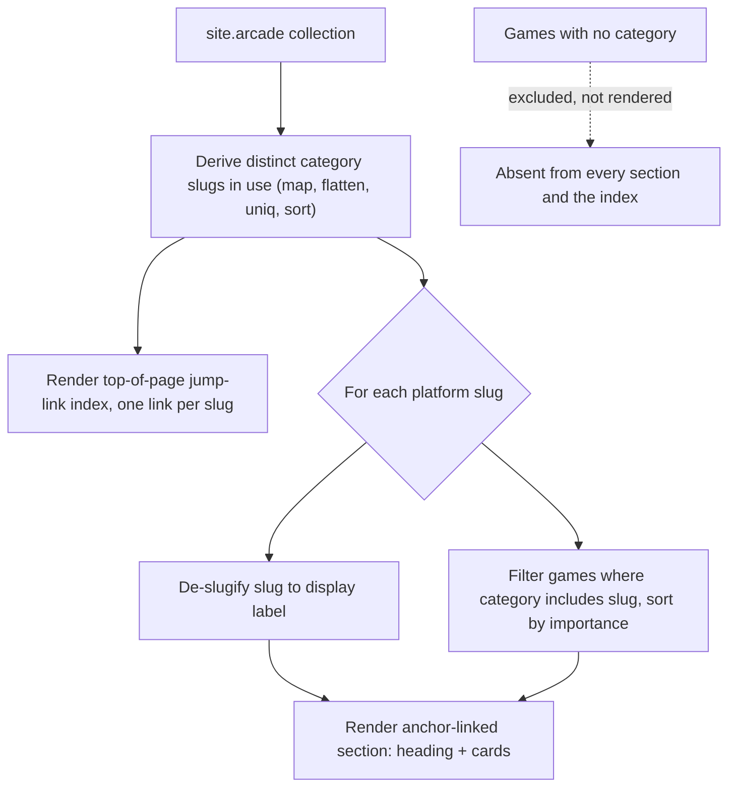

## Summary

Tag every arcade game with its exact-generation platform (e.g. `playstation-4`, `xbox-360`, `nintendo-ds`) and display them as anchor-linked platform sections on the arcade index page, reusing the projects page's categorized-display pattern. Separately, determine platforms for the 16 games added before platform tracking started, confirming each one with the user rather than guessing.

## Problem Frame

The arcade section's most recent 40 games already carry a platform name in their `description` field, but that data isn't structured or filterable — it's just prose under the title. The original 16 games (added before platform tracking began) have no platform recorded at all. The user wants platform turned into a real, filterable tag using the site's existing category mechanism, and wants the missing platform data filled in only after confirming each game with them directly.

---

## Requirements

**Platform tagging & display**

- R1. Each of the 40 games with already-known platform data carries an explicit `category` tag (exact-generation slug), without altering any existing achievement or flavor text in `description`.
- R2. The arcade index page groups games into anchor-linked sections by platform, one section per distinct platform tag in use, mirroring the projects page's categorized-display pattern.
- R3. Platform section headings and anchors render as clean, human-readable labels even though the underlying tag values are URL-safe slugs.
- R4. Games without a confirmed platform tag do not appear in any platform section until one is confirmed.

**Platform data completion**

- R5. Each of the 16 previously-undetermined games has its platform recorded only after explicit per-game confirmation with the user; none are guessed or defaulted silently.

---

## Key Technical Decisions

- **Reuse the projects page's anchor-linked category-section pattern, not new JS filtering.** Confirmed with the user: no click-to-filter/hide-show mechanism exists anywhere in this theme today, so building one would be new functionality rather than a reuse. The existing pattern renders every category as its own section with a jump-link, which is what ships here.
- **Platform tags use exact-generation values, not broad manufacturer buckets.** Confirmed with the user: tags are `playstation-3`, `playstation-4`, `xbox-360`, `nintendo-ds`, `nintendo-3ds`, `game-boy-advance`, `wii`, `pc`, `arcade-cabinet` — not a flat `nintendo`/`playstation`/`xbox` grouping.
- **Tag values are slugs; section headings de-slugify for display.** The existing category mechanism (`_pages/projects.md`) prints the raw category string as both the anchor `id` and the visible heading, and the current project categories (`research`, `school`, `personal`) never needed multi-word values. Platform slugs need a display transform (replace `-` with a space, then capitalize) plus a small manual label override for acronym platforms — a naive capitalize turns `pc` into "Pc", not "PC".
- **`description` and platform `category` are decoupled.** In U1's 40 games, `description` is cleared once `category` takes over that role, except `_arcade/elden-ring.md`, whose achievement text stays. In U3's 16 games, the same rule applies once each is confirmed: clear `description` only if it was standing in for the platform with no separate flavor text; keep it otherwise (this covers Halo Infinite, Hearthstone, 2048, Super Smash Bros. Ultimate, Skyrim, Super Auto Pets, and Baldur's Gate 3, all of which currently hold achievement text, not bare platform names).
- **The arcade-cabinet bucket is tagged `arcade-cabinet`, not `arcade`.** Avoids colliding with the section's own page name/URL (`/arcade/`).
- **The platform section list is derived dynamically, not hand-maintained.** Unlike `_pages/projects.md`'s static `display_categories: [personal, school]` front-matter list, the arcade page computes its section list from the distinct `category` values actually present in `site.arcade`. A static list (the reused pattern's default) would drift out of sync as more games and platforms are added over time.
- **Games without a confirmed platform are excluded from the display entirely, not shown in an "Unsorted" section.** Confirmed with the user: unverified platform data should not appear publicly at all, not even in a misc/pending bucket.
- **A new `enable_arcade_categories` config flag mirrors the existing `enable_project_categories` convention**, giving an explicit off-switch. When false, the page falls back to the current flat `sorted_games = site.arcade | sort: "importance"` listing — the same behavior as today, before this plan — rather than rendering nothing.
- **A top-of-page jump-link index is added, beyond what the reused pattern provides.** Confirmed with the user: `_pages/projects.md`'s categorized branch never needed a table of contents at only two categories, but with 9+ platform sections here, a small index at the top of `/arcade/` linking to each section is necessary for navigation.
- **Games within each platform section keep the site's existing importance-based order.** Mirrors `_pages/projects.md`'s `categorized_projects | sort: "importance"` step, applied to each platform's filtered subset — the categorization only groups games into sections, it doesn't change their relative order.
- **Alphabetical section order (by slug) is accepted as-is.** Not reordered by console generation or game count; simplest to derive and maintain as new platforms are added.
- **Sparse one- or two-game sections (e.g. `arcade-cabinet`, `nintendo-3ds`, `wii`) use the same section layout as larger ones.** No special-cased compact treatment for small platforms at this roster size.

---

## High-Level Technical Design

The arcade index page's rendering pipeline for the categorized view:

---

## Implementation Units

### U1. Tag the 40 already-platform-known games

**Goal:** Convert each of the 40 games' existing platform text into an explicit `category` slug, per the decoupling decision above.

**Requirements:** R1

**Dependencies:** None

**Files:**

| Platform slug | Files |
|---|---|
| `playstation-4` | `_arcade/elden-ring.md`, `_arcade/uncharted-4-a-thiefs-end.md`, `_arcade/littlebigplanet-3.md`, `_arcade/just-cause-3.md`, `_arcade/ratchet-clank-ps4.md`, `_arcade/lovers-in-a-dangerous-spacetime.md`, `_arcade/horizon-zero-dawn.md` |
| `playstation-3` | `_arcade/ratchet-clank-tools-of-destruction.md`, `_arcade/ratchet-clank-crack-in-time.md`, `_arcade/ratchet-clank-all-4-one.md`, `_arcade/ratchet-clank-full-frontal-assault.md`, `_arcade/uncharted-drakes-fortune.md`, `_arcade/uncharted-2-among-thieves.md`, `_arcade/uncharted-3-drakes-deception.md`, `_arcade/sly-cooper-thievius-raccoonus.md`, `_arcade/sly-2-band-of-thieves.md`, `_arcade/sly-3-honor-among-thieves.md`, `_arcade/child-of-light.md`, `_arcade/heavenly-sword.md`, `_arcade/castle-crashers.md` |
| `xbox-360` | `_arcade/halo-combat-evolved.md`, `_arcade/halo-2.md`, `_arcade/halo-3.md`, `_arcade/halo-reach.md` |
| `nintendo-ds` | `_arcade/pokemon-pearl.md`, `_arcade/pokemon-platinum.md`, `_arcade/lego-star-wars-complete-saga.md`, `_arcade/pokemon-mystery-dungeon-explorers-of-darkness.md` |
| `nintendo-3ds` | `_arcade/pokemon-x.md`, `_arcade/fire-emblem-awakening.md` |
| `game-boy-advance` | `_arcade/pokemon-ruby.md`, `_arcade/pokemon-firered.md`, `_arcade/pokemon-emerald.md` |
| `wii` | `_arcade/super-mario-galaxy.md`, `_arcade/a-boy-and-his-blob.md` |
| `pc` | `_arcade/minecraft.md`, `_arcade/hyper-light-drifter.md`, `_arcade/slay-the-spire.md`, `_arcade/a-way-out.md` |
| `arcade-cabinet` | `_arcade/time-crisis-4.md` |

**Approach:** Add `category: [<slug>]` to each file's front matter per the table above. For the 39 games whose `description` is only the bare platform name, remove `description`. For `_arcade/elden-ring.md`, keep `description: 100% trophy completion (PS4).` unchanged and add `category: [playstation-4]`.

**Patterns to follow:** `_projects/1_project.md`'s `category: [...]` front-matter shape.

**Test expectation:** none -- front-matter data change with no independent rendering behavior; covered by U4's render check.

**Verification:** Every file in the table carries the correct `category` slug; `_arcade/elden-ring.md` still has its achievement `description`; the other 39 files no longer have a `description` field.

---

### U2. Add platform category display to the arcade index page

**Goal:** Render arcade games grouped into anchor-linked platform sections on `_pages/arcade.md`, following the High-Level Technical Design above.

**Requirements:** R2, R3, R4

**Dependencies:** U1

**Files:**

- `_pages/arcade.md` (modify — categorized rendering branch)
- `_config.yml` (modify — add `enable_arcade_categories: true`)

**Approach:** Mirror `_pages/projects.md`'s categorized branch (loop over categories, `where: "category", category`, anchor `id`/jump-link, `` per game), with these changes:
- Derive the category list dynamically: `site.arcade | map: "category" | flatten | uniq | sort` (the `flatten` step is required — `category` is an array field per game, so `map` alone returns an array of arrays, not a flat list of slugs).
- Before rendering the top-of-page jump-link index, render one link per derived slug (a new element beyond what `_pages/projects.md` needed at its scale).
- Within each platform section, sort the filtered games by `importance` (`categorized_games | sort: "importance"`), matching `_pages/projects.md`'s own `categorized_projects | sort: "importance"` step, so grouping by platform doesn't change each game's relative order.
- Build the display label from the slug via a space-replace-and-capitalize transform, with a small manual override map for acronym platforms (`pc` → "PC").
- Games with no `category` are skipped entirely by the `where` filter and never appear in the derived slug list, so they're absent from both the jump-link index and every section — no separate exclusion check is needed.
- When `site.enable_arcade_categories` is `false`, keep the current flat `sorted_games = site.arcade | sort: "importance"` listing (today's behavior) as the fallback branch.

**Patterns to follow:** `_pages/projects.md`'s categorized branch; `_includes/projects.liquid` (reused as-is for card rendering).

**Test scenarios:**
- Happy path: each platform section shows exactly the games tagged with that platform's slug, and only those, sorted by `importance`.
- Happy path: section headings and anchor IDs render as human-readable labels (`Playstation 4`, not `playstation-4`), including the `PC` acronym override.
- Happy path: the top-of-page jump-link index lists exactly the derived platform slugs, and each link navigates to its matching section.
- Edge case: a game with no `category` does not appear in any section, the jump-link index, or as an empty section.
- Edge case: adding a new platform slug to any game later (without touching `_pages/arcade.md`) produces a new section and index entry automatically, confirming the dynamic derivation works.
- Edge case: with `enable_arcade_categories: false`, the page renders the current flat, non-categorized list.

**Verification:** Build the site locally, visit `/arcade/`, confirm every distinct platform slug from U1 has its own section and index entry with the right games in importance order, confirm index links navigate correctly, and confirm none of the still-unconfirmed 16 games (from U3) appear anywhere on the page.

---

### U3. Determine platforms for the 16 previously-undetermined games

**Goal:** Confirm and record the platform for each game added before platform tracking started, plus resolve the generic "Pokemon" entry's identity, without guessing.

**Requirements:** R5

**Dependencies:** None (independent of U1/U2; its output feeds U2's display once confirmed)

**Files:** `_arcade/pokemon.md`, `_arcade/hades.md`, `_arcade/marvels-spider-man.md`, `_arcade/skyrim.md`, `_arcade/hogwarts-legacy.md`, `_arcade/risk-of-rain-2.md`, `_arcade/risk-of-rain-returns.md`, `_arcade/hollow-knight.md`, `_arcade/undertale.md`, `_arcade/super-auto-pets.md`, `_arcade/fortnite.md`, `_arcade/baldurs-gate-3.md`, `_arcade/halo-infinite.md`, `_arcade/hearthstone.md`, `_arcade/2048.md`, `_arcade/super-smash-bros-ultimate.md`

**Execution note:** Confirm every platform with the user via a blocking question before writing any front matter — do not infer or default silently, even for near-certain cases (e.g., Super Smash Bros. Ultimate as a Switch exclusive, or Skyrim's mod evidence suggesting PC). Also confirm what the generic `_arcade/pokemon.md` entry (added before the specific Pokemon Pearl/Platinum/Ruby/FireRed/Emerald/X entries existed) is meant to represent — a distinct title, or a leftover that should be merged or removed.

**Approach:** Once a platform is confirmed for a game, apply it identically to U1's pattern: add `category: [<slug>]`, and clear `description` only if it was standing in for the platform with no separate achievement text.

**Test expectation:** none -- front-matter data change, no independent rendering behavior.

**Verification:** Every file in the list above either carries a confirmed `category` value or is explicitly left untagged with the reason noted (e.g., user deferred that title). U3 and U4 may close with some of the 16 games still deferred — an incomplete confirmation round doesn't block the rest of the plan; deferred titles simply stay excluded per R4 until revisited. If `_arcade/pokemon.md`'s identity question goes unanswered, the default is to leave it as-is (untagged, distinct file) rather than merge or delete it.

---

### U4. Full-site verification

**Goal:** Confirm the categorized platform display renders correctly end-to-end once U1–U3 have landed.

**Requirements:** R1, R2, R3, R4

**Dependencies:** U1, U2, U3

**Files:** None (verification only).

**Test scenarios:**
- Happy path: every platform section present after U1–U3 shows exactly its tagged games, in importance order.
- Happy path: the top-of-page jump-link index matches the rendered sections exactly, with working links.
- Edge case: acronym platform label (`pc` → "PC") renders correctly, not "Pc".
- Edge case: any of the 16 games left unconfirmed after U3 (if the user deferred any) do not appear in any section or the index.
- Integration: build completes with no Jekyll errors from the new `category`/`enable_arcade_categories` fields.

**Verification:** `docker compose up --build`, visit `/arcade/`, walk every section against the U1 table and U3's resolved answers.

---

## Scope Boundaries

**In scope:** Exact-generation platform tags on all 56 games (pending U3's confirmations), anchor-linked categorized display on the existing arcade index page, and confirmed platform data for the 16 previously-untagged games.

**Out of scope / Deferred to Follow-Up Work:**
- Real interactive click-to-filter JavaScript — considered and declined in favor of reusing the existing anchor-section pattern (see Key Technical Decisions).
- A dedicated per-platform archive page in the jekyll-archives style (like the bookshelf's tag pages) — the anchor-section approach was chosen instead; revisit if the anchor approach feels insufficient as the roster grows.
- Backfilling screenshots or achievements for placeholder games — unrelated to platform tagging.

---

## Sources & Research

- `_pages/projects.md` (categorized branch being mirrored) and `_includes/projects.liquid` (card renderer, reused as-is).
- `_config.yml`'s `enable_project_categories` flag (the convention `enable_arcade_categories` mirrors).
- Direct audit of all 56 `_arcade/*.md` files this session, establishing which games already carry platform data (40) versus which need confirmation (16).
